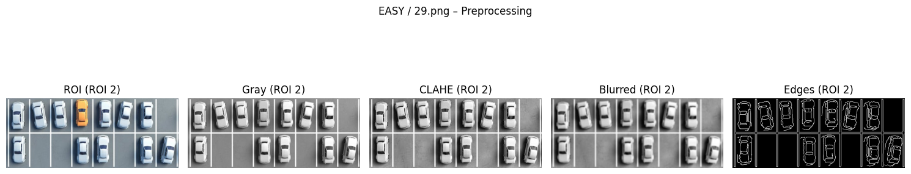

<h1 align="center">Parking Spot Detection System</h1>

Classical Image Processing Based Parking Space Detection and Classification

---

# Overview

This project implements a classical image processing pipeline to detect parking spaces and classify them as occupied or empty using static parking lot images.

The system was designed using traditional computer vision and image processing techniques instead of deep learning models in order to create a lightweight, interpretable, and computationally efficient solution suitable for embedded and low-resource environments.

The dataset is divided into three difficulty levels:

- Easy
- Medium
- Hard

For simplicity, the complete processing workflow is demonstrated below using the Easy dataset.

---

# Why Classical Image Processing?

There are two common approaches for parking spot detection:

## Classical Image Processing

Uses manually designed operations such as:

- Grayscale conversion
- CLAHE contrast enhancement
- Gaussian blurring
- Edge detection
- Hough line detection
- Morphological operations

### Advantages

- Lightweight and computationally efficient
- Easy to understand and debug
- No large training dataset required
- Suitable for embedded systems
- Transparent and explainable processing stages
- Faster development for structured environments

### Limitations

- Sensitive to shadows and lighting changes
- Reduced performance under perspective distortion
- Requires manual parameter tuning
- Less robust in highly complex scenes

---

## Deep Learning Approaches

Uses trained neural networks such as CNNs and object detection models.

### Advantages

- More robust to visual complexity
- Better handling of shadows and occlusions
- Higher real-world accuracy

### Limitations

- Requires large labeled datasets
- Higher computational cost
- Requires GPU resources and training time
- Less interpretable compared to classical methods

---

# Why This Approach Was Chosen

This project focuses on understanding and implementing the complete parking detection pipeline using traditional computer vision techniques.

The main reasons for choosing classical image processing were:

- Lower computational complexity
- Better understanding of image processing fundamentals
- Easier deployment on embedded systems
- Transparent step-by-step processing
- No dependency on large datasets

The project demonstrates how far classical techniques can perform before advanced AI-based approaches become necessary.

---

# Easy Dataset Processing Pipelines

Each figure below represents a complete processing pipeline visualization.

Every pipeline image includes:
- Original image or ROI
- Grayscale conversion
- CLAHE enhancement
- Gaussian blurring
- Edge extraction
- Parking boundary analysis

---

## Image 1 Processing Pipeline

This figure shows the complete parking detection pipeline applied to Easy Image 1.

---

## Image 2 Processing Pipeline

This figure shows the complete processing pipeline applied to Easy Image 2.

---

## Image 3 - ROI A Processing Pipeline

Image 3 was divided into multiple Regions of Interest (ROIs) to improve parking boundary extraction and occupancy analysis.

This figure shows the complete processing pipeline applied to ROI A of Image 3.

---

## Image 3 - ROI B Processing Pipeline

This figure shows the complete processing pipeline applied to ROI B of Image 3.

---

## Image 4 - ROI A Processing Pipeline

This figure shows the complete processing pipeline applied to ROI A of Image 4.

---

## Image 4 - ROI B Processing Pipeline

This figure shows the complete processing pipeline applied to ROI B of Image 4.

---

## Image 4 - ROI C Processing Pipeline

This figure shows the complete processing pipeline applied to ROI C of Image 4.

---

# Final Parking Spot Classification

The processed parking regions are combined to generate the final parking occupancy visualization.

- Green boxes represent empty parking spots
- Red boxes represent occupied parking spots

---

# Results on Different Difficulty Levels

## Easy Images

Easy images contain:

- Clear parking boundaries
- Minimal shadows
- Stable lighting conditions
- Limited visual clutter

The system achieved highly accurate parking slot detection and occupancy classification on these images.

---

## Medium Images

Medium images include:

- Partial shadows
- Faded parking lines
- Moderate occlusions
- Uneven lighting

These conditions occasionally introduced false detections and slight grid misalignments.

---

## Hard Images

Hard images contain:

- Strong perspective distortion
- Heavy shadows
- Visual clutter
- Complex parking layouts
- Weak parking boundaries

These scenes required parameter tuning to achieve stable parking detection results.

---

# Technologies Used

- Python
- OpenCV
- NumPy
- Matplotlib

---

# Key Image Processing Techniques

- Grayscale Conversion
- CLAHE Contrast Enhancement
- Gaussian Blurring
- Sobel Gradient Computation
- Canny Edge Detection
- Hough Line Transform
- Morphological Opening
- ROI-Based Processing
- Parking Grid Formation
- Intensity-Based Occupancy Classification

---

# System Limitations and Failure Cases

Although the system performs well on simple parking scenes, several limitations were observed in medium and hard datasets.

## Sensitivity to Lighting

Strong shadows and uneven illumination reduce edge quality and affect occupancy classification accuracy.

## Perspective Distortion

Angled camera views can distort parking slot geometry, making grid formation difficult.

## Faded Parking Lines

Weak or unclear parking boundaries reduce the reliability of Hough line detection.

## Visual Clutter

Objects such as poles, nearby vehicles, road markings, and pavement texture can introduce false detections.

## Manual Parameter Tuning

Hard images required adjustment of thresholds and merging parameters for stable results.

## ROI Dependency

Different parking regions may require slightly different processing settings because visual conditions vary across the image.

---

# Overall Results

- Easy images produced highly accurate parking detection and classification
- Medium images showed occasional misclassifications due to shadows and faded markings
- Hard images required parameter tuning because of perspective distortion and clutter

The project demonstrates that classical image processing can still provide strong results in controlled environments while revealing the challenges faced in visually complex scenes.

---

# Future Improvements

- Perspective correction using homography
- Adaptive thresholding for changing lighting conditions
- Real-time video processing
- Hybrid classical + deep learning approach
- CNN-based occupancy classification
- Improved robustness under clutter and shadows

---

# Conclusion

This project successfully demonstrates a complete parking spot detection and classification pipeline using classical image processing techniques.

The system performs effectively in controlled environments and highlights the strengths of traditional computer vision methods in terms of simplicity, interpretability, and computational efficiency.

At the same time, the project also exposes the practical limitations of classical approaches when scene complexity increases.

This work provides a strong foundation for future improvements using advanced computer vision and deep learning techniques.
