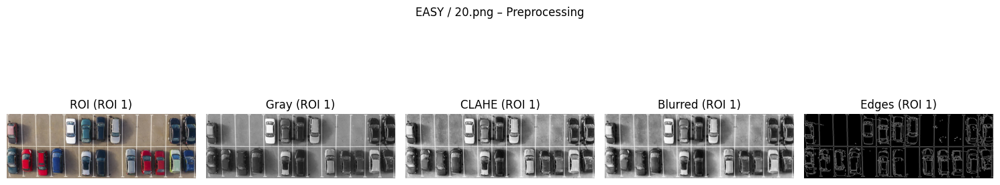
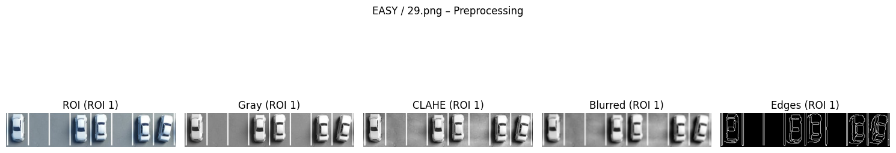
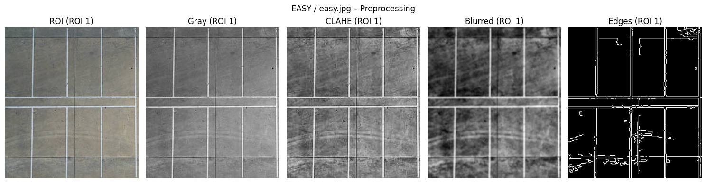
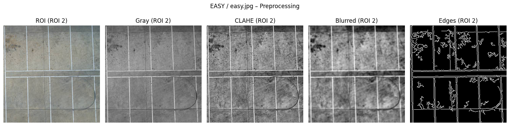
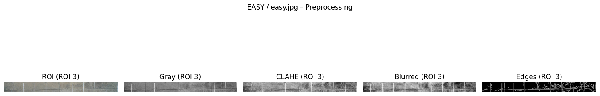
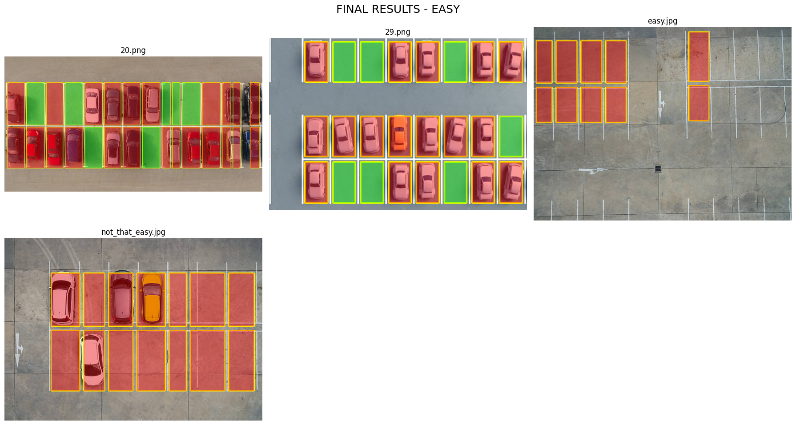

<h1 align="center">Parking Spot Detection System</h1>

Classical Image Processing Based Parking Space Detection and Classification

---

## Overview

This project implements a classical image processing pipeline to detect parking spaces and classify them as occupied or empty using static parking lot images.

The system was designed using traditional computer vision techniques instead of deep learning models in order to create a lightweight, interpretable, and computationally efficient solution.

The dataset is divided into three difficulty levels:

- Easy
- Medium
- Hard

For simplicity, the processing pipeline below is demonstrated using the Easy dataset.

---

## Why Classical Image Processing?

There are two common approaches for parking spot detection:

### Classical Image Processing
Uses manually designed operations such as:

- Edge detection
- Thresholding
- Morphological operations
- Hough line detection

#### Advantages
- Lightweight and computationally efficient
- Easy to understand and debug
- No large training dataset required
- Suitable for embedded systems
- Faster development for structured environments

#### Limitations
- Sensitive to lighting and shadows
- Reduced performance under perspective distortion
- Requires manual parameter tuning
- Less robust in highly complex scenes

---

### Deep Learning Approaches
Uses trained neural networks such as CNNs and object detection models.

#### Advantages
- More robust to visual complexity
- Better handling of shadows and occlusions
- Higher real-world accuracy

#### Limitations
- Requires large labeled datasets
- Higher computational cost
- Requires training and GPU resources
- Less interpretable compared to classical methods

---

## Why This Approach Was Chosen

This project focuses on understanding and implementing the complete parking detection pipeline using traditional computer vision techniques.

The main reasons for choosing classical image processing were:

- Lower computational complexity
- Better understanding of image processing fundamentals
- Easier deployment on embedded systems
- Transparent step-by-step processing
- No dependency on large datasets

The project demonstrates how far classical techniques can perform before advanced AI-based approaches become necessary.

---

## Processing Pipeline (Easy Set)

### 1. Input Image

---

### 2. Edge Detection and Feature Extraction

The image is converted to grayscale, smoothed using Gaussian blur, and processed using Sobel gradients and Canny edge detection.

---

### 3. Parking Line Detection

Horizontal and vertical parking boundaries are detected using the Hough Transform.

#### Vertical / Horizontal Line Detection

#### Merged Parking Lines

---

### 4. Grid Formation and Parking Spot Localization

Detected parking boundaries are merged to form parking slot grids.

#### Parking Grid Formation

#### Parking Slot Segmentation

#### Parking Spot Analysis

---

### 5. Final Parking Spot Classification

Green boxes indicate empty parking spots and red boxes indicate occupied parking spots.

---

## Difficulty Levels

| Difficulty Level | Description |
|---|---|
| Easy | Clear parking lines with minimal shadows and occlusions |
| Medium | Includes faded markings, partial shadows, and moderate visual complexity |
| Hard | Contains perspective distortion, clutter, uneven illumination, and complex layouts |

---

## Technologies Used

- Python
- OpenCV
- NumPy
- Matplotlib

---

## Key Image Processing Techniques

- Sobel Gradient Computation
- Canny Edge Detection
- Hough Line Transform
- Morphological Opening
- Erosion and Dilation
- Intensity-Based Occupancy Classification

---

## System Limitations and Failure Cases

Although the system performs well on simple parking scenes, several limitations were observed in medium and hard datasets.

### Sensitivity to Lighting

Strong shadows and uneven illumination reduce edge quality and affect occupancy classification accuracy.

### Perspective Distortion

Angled camera views can distort parking slot geometry, making grid formation difficult.

### Faded Parking Lines

Weak or unclear parking boundaries reduce the reliability of Hough line detection.

### Visual Clutter

Objects such as poles, nearby vehicles, road markings, and pavement texture can introduce false detections.

### Manual Parameter Tuning

Hard images required adjustment of thresholds and merging parameters for stable results.

---

## Results

- Easy images produced highly accurate parking detection and classification
- Medium images showed occasional misclassifications due to shadows and faded markings
- Hard images required parameter tuning because of perspective distortion and clutter

The project demonstrates that classical image processing can still provide strong results in controlled environments while revealing the challenges faced in visually complex scenes.

---

## Future Improvements

- Perspective correction using homography
- Adaptive thresholding for changing lighting conditions
- Real-time video processing
- Hybrid classical + deep learning approach
- CNN-based occupancy classification
- Improved robustness under clutter and shadows

---

## Conclusion

This project successfully demonstrates a complete parking spot detection and classification pipeline using classical image processing techniques.

The system performs effectively in controlled environments and highlights the strengths of traditional computer vision methods in terms of simplicity, interpretability, and computational efficiency.

At the same time, the project also exposes the practical limitations of classical approaches when scene complexity increases.

This work provides a strong foundation for future improvements using advanced computer vision and deep learning techniques.
